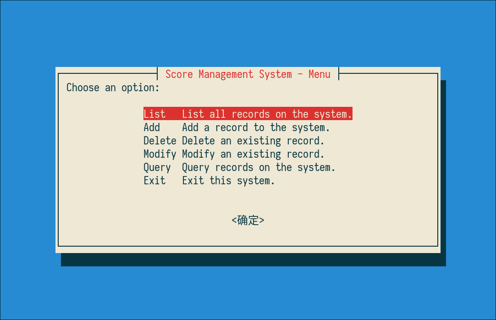
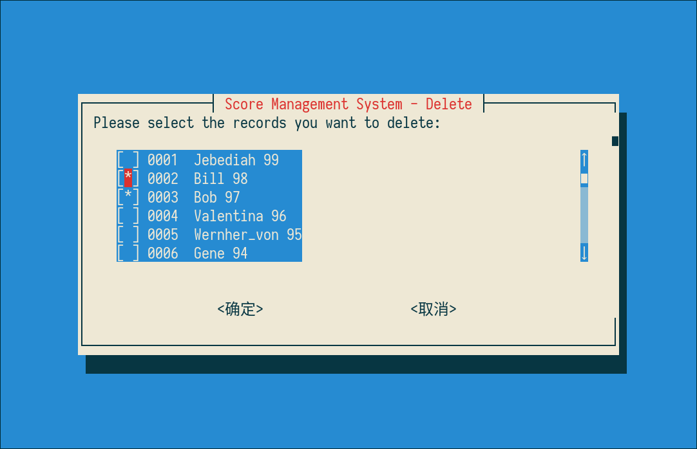

# whiptail-example

This is a simple example of a shell script that uses whiptail.

With whiptail, this script provides a user-friendly way to list, add, delete, modify, and query the transcript score.txt.

